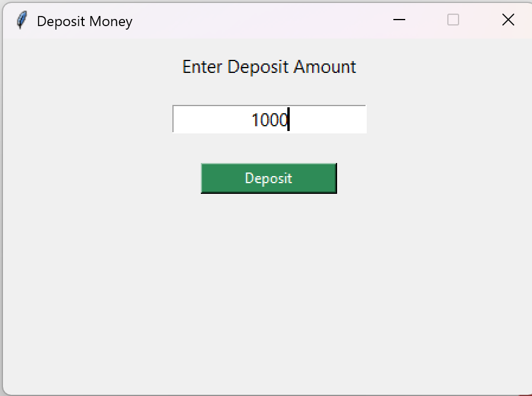
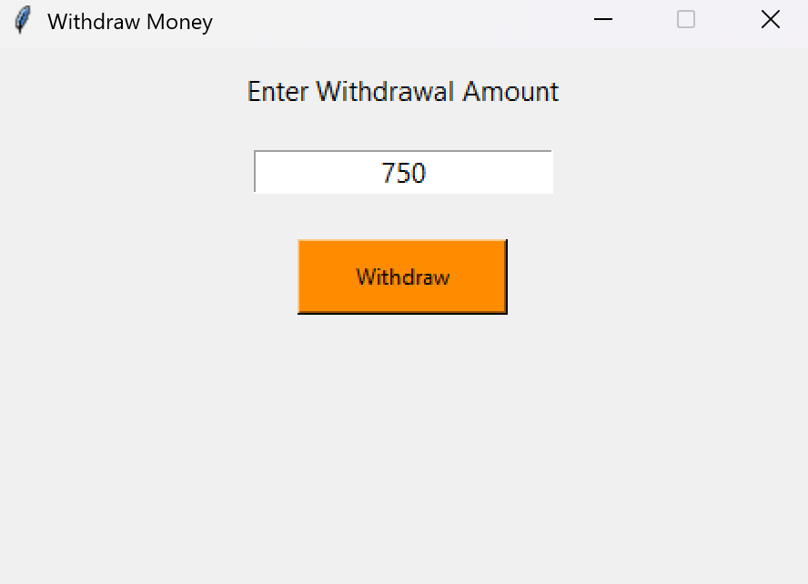
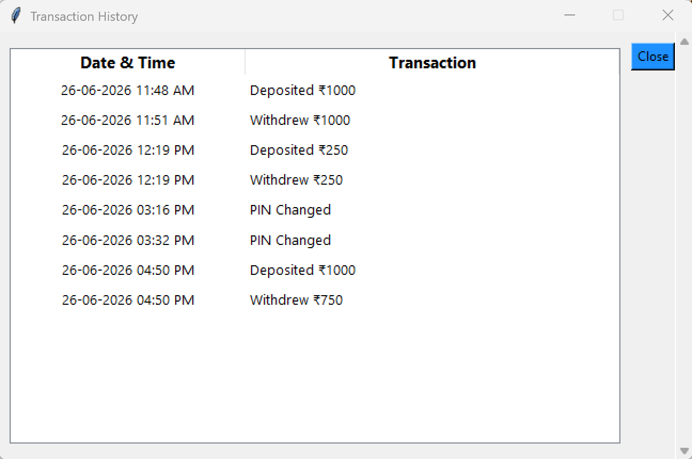
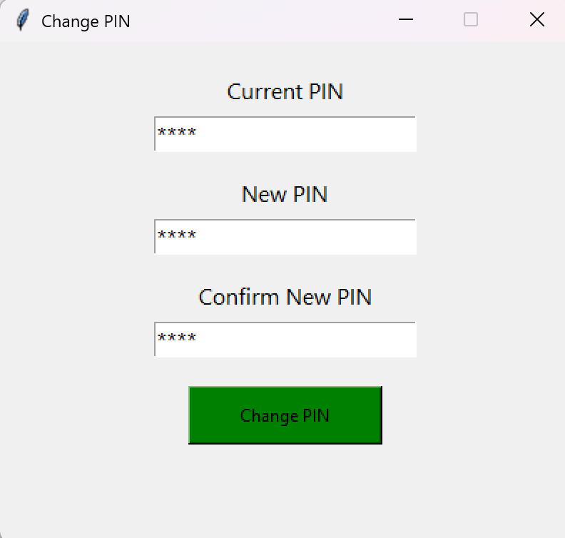
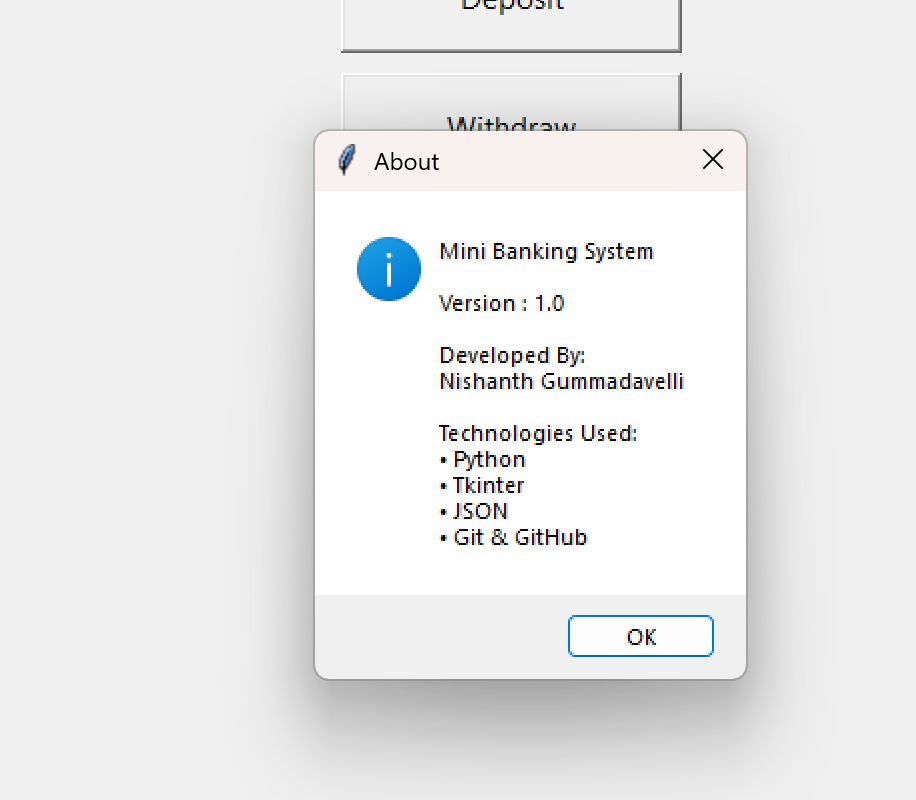

# 🏦 Mini Banking System

A desktop-based **Mini Banking System** developed using **Python** and **Tkinter**. This project simulates basic banking operations through a user-friendly graphical interface while storing account data locally using a JSON file.

It demonstrates Python programming, GUI development, file handling, modular programming, and version control using Git and GitHub.

---

# ✨ Features

* 🔐 Secure 4-digit PIN Login
* 🔒 Account Lock after 3 incorrect PIN attempts
* 💰 Deposit Money
* 💸 Withdraw Money
* 📜 Transaction History using Treeview with Scrollbar
* 🔑 Change PIN
* 🚪 Logout
* 📋 Menu Bar

  * Customer Care
  * About
  * Exit
* 💾 JSON-based account storage
* ⏰ Timestamp for every transaction

---

# 🛠 Technologies Used

* Python 3
* Tkinter
* ttk (Treeview)
* JSON
* Git
* GitHub

---

# 📂 Project Structure

```text
mini-banking-system/
│
├── main.py
├── banking.py
├── storage.py
├── account.json
├── README.md
├── .gitignore
└── screenshots/
    ├── login.png
    ├── dashboard.png
    ├── deposit.png
    ├── withdraw.png
    ├── transaction_history.png
    ├── change_pin.png
    └── about.png
```

---

# 🚀 Installation

## Clone the repository

```bash
git clone https://github.com/NishanthGummadavelli/Mini-Banking-System.git
```


---

## Open the project folder

```bash
cd Mini-Banking-System
```

---

## Run the application

```bash
python main.py
```

---

# 📖 How to Use

1. Login using the 4-digit PIN.
2. Access the dashboard.
3. Deposit money.
4. Withdraw money.
5. View transaction history.
6. Change your PIN.
7. Logout when finished.

---

# 📸 Screenshots

## Login Screen


---

## Dashboard


---

## Deposit



---

## Withdraw



---

## Transaction History



---

## Change PIN



---

## About



---

# 🔮 Future Improvements

* Multiple account support
* Database integration using SQLite or MySQL
* Money transfer between accounts
* User registration
* Admin panel
* Interest calculation
* Account statement export (PDF)

---

# 👨‍💻 Author

**Nishanth Gummadavelli**

B.Tech Computer Science and Engineering Student

GitHub: https://github.com/NishanthGummadavelli

---

# ⭐ Support

If you found this project useful or interesting, consider giving it a ⭐ on GitHub.
